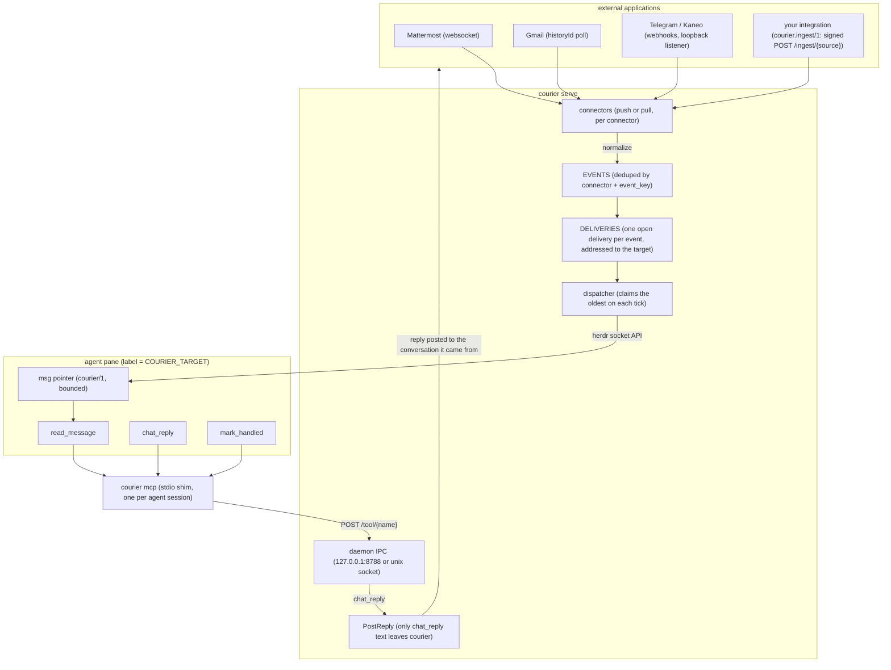
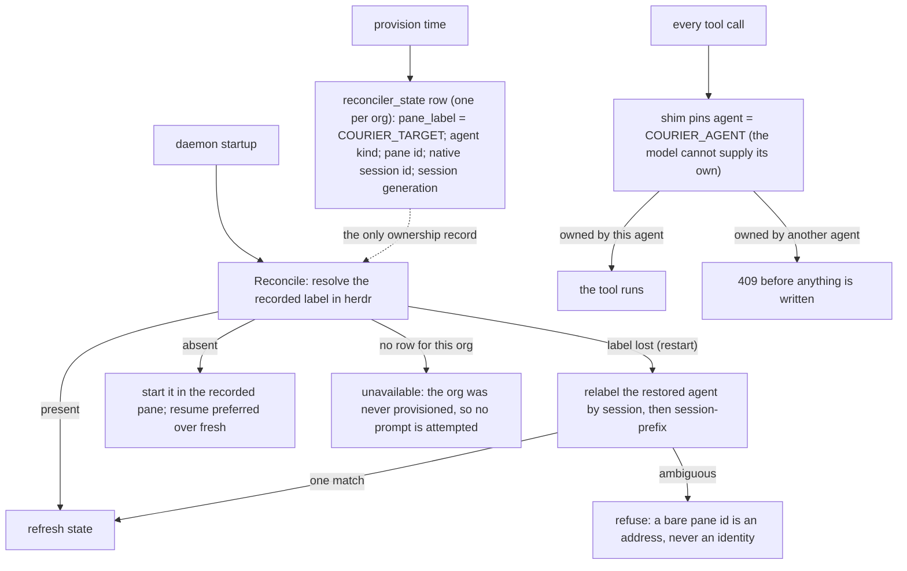
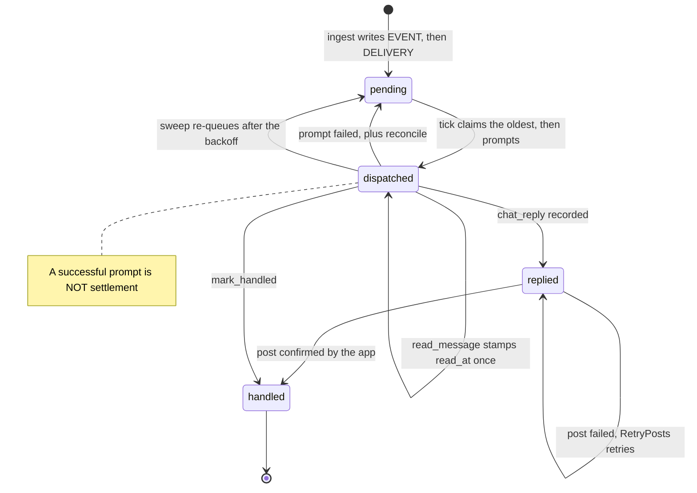

# courier

Courier is a generic bi-directional gateway between external chat applications and [herdr](https://herdr.dev)-driven coding agents. Each external message becomes a durable row in a SQLite ledger; courier delivers a bounded pointer to the agent, the agent reads and answers through MCP tools, and courier posts the reply back to the exact conversation it came from. Unanswered messages are redelivered until they are settled — by design, an agent can never silently drop a message.

One Go binary, four subcommands:

- `courier serve` — the daemon: SQLite ledger, connector ingestion, ordered dispatch through herdr's socket API, HTTP/unix IPC, reply posting, redelivery, and a shadow observation mode.
- `courier mcp` — per-session stdio MCP shim. It fetches the daemon's manifest and forwards tool calls; it does not deliver messages itself.
- `courier push` — reference signer that POSTs a `courier.ingest/1` event for an integration smoke test.
- `courier version` — binary version.

Supported connectors: **Mattermost**, **Gmail**, **Telegram**, and **Kaneo** (webhook-based project tracker events). Courier also takes events from any third-party integration over the [`courier.ingest/1` wire spec](./spec/ingest-1.md): signed HTTP in, signed reply callback out, with no Go code or rebuild needed. Courier is connector-agnostic at its core: a connector only needs to normalize events into the ledger and post replies.

## How it works

### The shape of the system



Inbound: a connector normalizes the external event into a ledger row; the dispatcher
claims the oldest unsettled delivery and pastes a bounded `<msg>` pointer into the
agent's pane through herdr. Outbound: the agent calls MCP tools, the per-session shim
forwards them to the daemon over IPC, and only `chat_reply` text ever reaches the
external application — the terminal the agent types in is not a channel.

### Who owns a channel

Agents never register themselves at runtime. Ownership is declared once, daemon-side,
and enforced on every call:



`COURIER_ORG` selects the ledger (and thus the reconciler_state row); `COURIER_TARGET`
is the herdr pane label every delivery is addressed to. A missing reconciler_state row
means the org was never provisioned — reconcile reports unavailable rather than
guessing, and no prompt is attempted.

### Acks and retries

There are two acknowledgements, and only the second one settles anything:



What the transitions leave out:

- `backoff = min(grace × (read ? read_factor : 1) × 2^attempts, cap)`, so a delivery the
  agent read but never settled comes back more slowly than one it never touched.
- `read_message` stamps `read_at` once. It is a receipt, not settlement; its only other
  effect is that read factor on the next backoff.
- A prompt that fails also triggers reconcile, and an unavailable target may additionally
  notify the channel the message came from.
- A failed post keeps `post_error` on the reply row and stays `replied`; `RetryPosts` owns
  it from then on, once per tick.

Settlement writes `handled_at` through exactly one store path, shared by the confirmed
post and `mark_handled`. Until then the delivery is redelivered forever with growing
backoff — and a terse note inside `<msg>` telling the agent whether it previously read
but never settled the message. A failed outbound post is retried by courier, not the agent: a
repeat `chat_reply` is recognized as a duplicate and never double-posts.

### The draft guard

herdr's `agent.prompt` is a keystroke transport, not a queue: it writes the prompt at the
pane's cursor and presses Enter a beat later. A pane whose composer already holds a
human's unsent keystrokes therefore submits draft+message as one prompt — the human's
half-typed sentence goes to their own agent, and the delivered message is corrupted by
whatever preceded it.

So before it claims a delivery, courier reads the target pane's rendered screen and looks
for unsent input in the harness composer (omp and Claude Code are recognized). On a
draft, the drain stops before claiming: nothing is written to the pane, the row keeps its
place and its attempt count, `GET /health` reports `draft_hold_pane`, and one log line
says dispatch is held. The next tick after the composer clears delivers it.

Detection is one-sided on purpose. An unfamiliar harness, a composer it cannot locate, or
a failed pane read dispatches exactly as it did before the guard, because starving a
durable queue is worse than the clobber the guard prevents. `COURIER_DRAFT_GUARD=0`
turns it off.

What it cannot cover: a human who starts typing inside herdr's own paste-then-Enter
window, and any harness whose composer this build does not read. Closing those needs a
non-keystroke delivery path into the running session, which herdr's socket API does not
offer.

A held message is otherwise invisible, so the first hold also raises a herdr toast
(`notification.show`, one per hold, never repeated while the same pane stays held). A
headless session answers `no_foreground_client`, which is logged and is not an error;
`COURIER_DRAFT_NOTIFY=0` turns the toast off without touching the guard.

### The inbox and delivery control

`GET /inbox` is the open queue as a human needs to read it — the unhandled pending and
dispatched rows for this target, oldest first, each with connector, sender, age, attempt
count and the same bounded preview the envelope carries, plus the live `draft_hold` and
`paused` state. It settles nothing: an unanswered message cannot be dismissed from a list.

`POST /kick` runs one tick now and answers `{"ok":true,"busy":…,"outcomes":N}`; `busy` means
another tick already holds the serialization lock, not a failure. `POST /pause` with
`{"paused":true|false}` stops or resumes claiming, and resuming delivers immediately instead
of waiting for the next tick. A paused dispatcher claims nothing and burns no attempt; pause
is process-lifetime state, so restarting courier resumes delivery.

The CLI wraps those three for humans and for herdr plugin actions:

```sh
courier inbox                     # render the queue; [enter] refresh [d] deliver now [p] pause [q] quit
courier kick                      # dispatch now
courier kick --if-pane-matches    # herdr event hook: kick only when the hold names $HERDR_PLUGIN_EVENT_JSON's pane
courier pause --toggle            # also --on / --off
courier plugin-probe              # startup reachability check; always exits 0
```

`courier push` signs and POSTs a `courier.ingest/1` event. It is the reference signer and the conformance smoke test for a new integration:

```sh
courier push --source sentry --conversation sentry:issue:4182 \
  --event-key sentry:issue:4182:event:99137 --user sentry --trigger alert \
  --content 'TypeError: cannot read property "id" of undefined'
```

It uses the source secret from its declaration or `COURIER_INGEST_SECRET`, and sends to `COURIER_INGEST_URL` or the local ingest listener; no secret is accepted on the command line.

They reach the daemon at `COURIER_HOST_URL` (default `http://127.0.0.1:8788`) and need no
agent identity. [`plugin/`](./plugin) packages them as a herdr plugin: `herdr plugin link
./plugin` gives a `prefix+i` inbox popup, the toast, deliver-now/pause actions, and the
`pane.agent_status_changed` hook that lands a held message about a second after you submit
your own prompt instead of up to `COURIER_TICK_MS` later.

## Requirements

- Go 1.25+ (or [mise](https://mise.jdx.dev), which pins the toolchain in `mise.toml`)
- A reachable herdr session (socket API)
- Credentials for whichever external applications you want to bridge

## Build and test

```sh
mise run build   # or: go build -o courier .
mise run test    # go test -race ./...
```

## Run the daemon

```sh
export COURIER_ORG=example          # ledger namespace; also names the sqlite file
export COURIER_TARGET=my-agent      # the herdr agent label messages route to
courier serve
```

Courier connects to herdr through `HERDR_SOCKET_PATH` or `HERDR_SESSION`; otherwise it resolves the default herdr session socket. The daemon binds `127.0.0.1:8788`, stores its ledger at `./data/$COURIER_ORG.sqlite`, and ticks every 15 seconds.

Core options (every `COURIER_*` name also accepts its legacy `CHANNEL_*` spelling; setting both to different values fails at boot rather than choosing silently):

| Variable | Default | Purpose |
|---|---:|---|
| `COURIER_ORG` | required | Ledger namespace and sqlite filename. |
| `COURIER_TARGET` | required | herdr agent label that receives messages. |
| `COURIER_DATA_DIR` | `./data` | Ledger and runtime data root. |
| `COURIER_DB_PATH` | `$DATA_DIR/$ORG.sqlite` | Explicit SQLite path. |
| `COURIER_BIND` / `COURIER_PORT` | `127.0.0.1` / `8788` | TCP IPC bind. |
| `COURIER_SOCKET` | unset | Unix IPC socket; overrides TCP listening. |
| `COURIER_PROMPT_TIMEOUT_MS` | `120000` | herdr prompt timeout. |
| `COURIER_TICK_MS` | `15000` | Sweep, reply-retry, and dispatch cadence; `0` disables ticks. |
| `COURIER_CONNECTORS` | inferred | Comma-separated connector allowlist. |
| `COURIER_ENVELOPE_PREVIEW` | on | Include the bounded one-line preview in `<msg>`. |
| `COURIER_DRAFT_GUARD` | on | Hold dispatch while the target pane's composer holds unsent human input. |
| `COURIER_DRAFT_NOTIFY` | on | Raise a herdr toast the first time a delivery is held behind a draft. |
| `COURIER_HOST_URL` | `http://127.0.0.1:8788` | Daemon IPC base URL used by `inbox`/`kick`/`pause`/`plugin-probe` and the MCP shim. |
| `COURIER_SHADOW` | off | Ingest and observe without prompts, replies, typing, or settlement. |
| `COURIER_SHADOW_HEARTBEAT_MS` | `900000` | Shadow health log cadence; `0` disables it. |
| `COURIER_REDELIVER_GRACE_MS` | `300000` | Base redelivery backoff. |
| `COURIER_REDELIVER_MAX_BACKOFF_MS` | `1800000` | Redelivery backoff cap. |
| `COURIER_REDELIVER_READ_FACTOR` | `4` | Extra backoff for read-but-unsettled messages. |

### Connector activation

Without `COURIER_CONNECTORS`, the presence of each connector's required configuration activates it. With an allowlist, only named connectors may activate; a named connector with missing requirements logs a warning and stays inactive.

**Mattermost** (websocket ingest, posting, thread routing):

```sh
export MATTERMOST_URL=https://mattermost.example.com
export MATTERMOST_BOT_TOKEN=...
# optional: MATTERMOST_BOT_USER_ID, MATTERMOST_ATTACHMENT_DIR
```
Channel mentions start or join a thread. Once mentioned, Courier durably follows
that thread and delivers every later message so the agent can decide whether a
reply is useful. For DMs, `chat_reply` can preserve the incoming location or set
`reply_mode` to `root`/`thread`.


**Gmail** (per-account polling via historyId):

```sh
export GMAIL_ACCOUNTS_FILE=/run/secrets/gmail-accounts.json   # or GMAIL_ACCOUNTS_JSON
# optional: GMAIL_POLL_SECONDS, GMAIL_ATTACHMENT_DIR
```

The accounts file is a JSON array; each entry names an `email` and a `token_command` — a shell command that prints a fresh OAuth access token as its last stdout line (55-minute cache, single-flight refresh).

**Telegram** (webhook ingest; activation requires the listen port plus its credentials):

```sh
export TELEGRAM_LISTEN_PORT=7784
export TELEGRAM_BOT_TOKEN=...
export TELEGRAM_WEBHOOK_SECRET=...
export TELEGRAM_ALLOWED_USER_IDS=42          # and/or TELEGRAM_ALLOWED_CHAT_IDS=-100xxxx
# optional: TELEGRAM_BOT_USERNAME, TELEGRAM_BOT_USER_ID, TELEGRAM_GROUP_REQUIRE_MENTION,
#           TELEGRAM_ATTACHMENT_DIR, TELEGRAM_CLEAR_DISABLED, TELEGRAM_CLEAR_ACK,
#           TELEGRAM_DISCONNECT_NOTICE
```

Telegram reaches the webhook on the loopback listener; put your own TLS-terminating proxy or tunnel in front of it. `TELEGRAM_WEBHOOK_SECRET` is validated against `X-Telegram-Bot-Api-Secret-Token` on every request.

**Kaneo** (signed webhooks; activation requires the listen port plus all three credentials):

```sh
export KANEO_LISTEN_PORT=8790
export KANEO_CHANNEL_WEBHOOK_SECRET=...
export KANEO_API_BASE=https://kaneo.example.com
export KANEO_BOT_KEY=...
# optional: KANEO_WORKSPACE_ID, KANEO_BOT_ACTOR
```

**Ingest** (third-party integrations over [`courier.ingest/1`](./spec/ingest-1.md)):

```sh
export COURIER_INGEST_LISTEN_PORT=8791
export COURIER_INGEST_SOURCES_FILE=/run/secrets/courier-ingest-sources.json
# or: COURIER_INGEST_SOURCES_JSON='[...]'
```

The sources value is a JSON array of declarations:

```json
[
  {
    "source": "sentry",
    "secret": "…",
    "reply_url": "http://127.0.0.1:9114/courier/reply",
    "instructions": "Sentry alerts arrive with connector=\"sentry\"."
  },
  {
    "source": "ci",
    "secret": "…",
    "reply_url_prefixes": ["https://ci.example.com/courier/"],
    "instructions": "Each run POSTs its own reply_url; the answer goes back to that run."
  }
]
```

Each declared source becomes its own connector, so `COURIER_CONNECTORS` names it like a built-in and the agent sees `connector="<source>"`. A source with neither `reply_url` nor a usable `reply_url_prefixes` match is one-way: `chat_reply` is refused at the tool boundary and the agent settles with `mark_handled` instead.

A sender may route its own answer with a per-event `reply_url`, but only inside a prefix declared here — courier re-checks it when it posts and never follows a redirect. Unbounded sender-chosen destinations would make courier post signed, agent-authored text anywhere the holder of one source secret named, including its own unauthenticated IPC on 127.0.0.1:8788 and the cloud metadata service.

The listener is loopback-only, so front it with your own tunnel or TLS-terminating reverse proxy. See the [wire spec](./spec/ingest-1.md) for the request/response contract and every limit.

Secrets belong in environment injection, never command arguments.

## Run the MCP shim

An agent session config launches:

```sh
COURIER_AGENT=my-agent \
COURIER_HOST_URL=http://127.0.0.1:8788 \
courier mcp
```

`COURIER_AGENT` is required; the shim attaches it to every tool call and never lets the model supply its own. `COURIER_HOST_URL` defaults to `http://127.0.0.1:8788`. The shim retries `/manifest`, caches the last valid manifest under `$XDG_CACHE_HOME/courier` (or `~/.cache/courier`), serves the manifest's tools verbatim over stdio, and exits cleanly when stdin closes.

The daemon IPC surface is:

- `GET /health`
- `GET /manifest`
- `POST /tool/{name}`
- `POST /handled`

## The message contract (`courier/1`)

Incoming events reach the agent as bounded `<msg>` pointers:

```text
<msg delivery_id="d-123" conversation_id="channel-7:thread-9" user="Dana" connector="mattermost" redelivery="0" trigger="dm" schema="courier/1">
Can you check whether the Friday batch went out…
</msg>
```

The pointer is not the message. The agent must call `read_message` with the `delivery_id`, then settle exactly once: `chat_reply` (ids passed back unchanged) when a visible reply serves the sender, or `mark_handled` when none is warranted. Reading is a receipt, not settlement; doing neither causes redelivery with a terse note inside `<msg>`. Courier emits no guidance after a closing tag. The complete schema — attribute order, preview bounds, escaping rules, redelivery wording, and the tool workflow — is defined in [`SKILL.md`](./SKILL.md). Install that file wherever your agents read skills.

## Lifecycle

Startup is ordered: open/migrate the ledger, reclaim stale dispatches, reconcile the herdr target, start configured connectors, bind IPC, then drain. Shutdown stops tickers, drains connector shutdown (including in-flight webhooks), shuts down IPC, closes herdr, and closes SQLite.

## License

MIT — see [LICENSE](./LICENSE).
