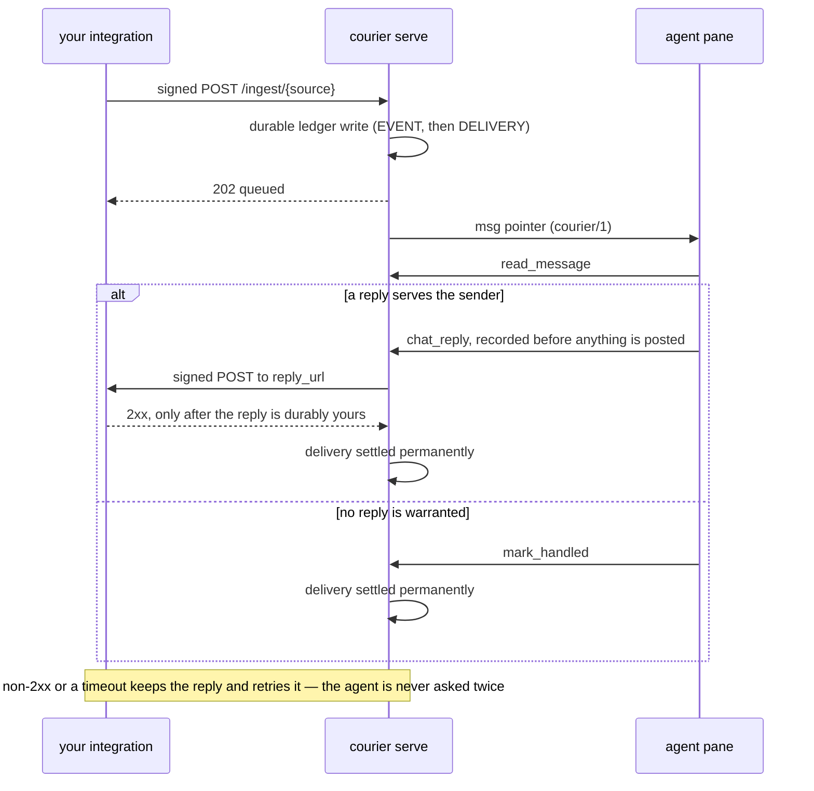

# `courier.ingest/1` — the integration wire spec

This document specifies how any program, in any language, on any host that can reach
courier over HTTP, pushes a message into a herdr-driven coding agent and receives the
agent's answer back.

It is the contract courier implements; write to it and your integration works with no
courier code, no Go, and no rebuild. The words MUST, MUST NOT, SHOULD, SHOULD NOT and MAY
carry their [RFC 2119](https://www.rfc-editor.org/rfc/rfc2119) meaning.

Two roles:

- **Sender** — your integration. It signs and POSTs an event to courier.
- **Reply receiver** — your integration again, optionally, at an HTTP endpoint courier
  POSTs the agent's answer to. A source without one is *one-way*: courier tells the agent
  that answers are impossible, and the agent settles without replying.



## 1. What courier guarantees a sender

These are the properties an integration is buying by writing to this spec instead of
piping text at a terminal:

1. **A 2xx to your POST is durable.** The event and its delivery are committed to
   courier's SQLite ledger before the response is written. Courier may restart, the agent
   may be down, the pane may not exist yet; the message is not lost.
2. **Exactly-once queueing per `event_key`.** Re-POSTing the same `event_key` for the same
   source never queues a second message. Retry freely.
3. **Delivery is not settlement, and courier will not stop.** An unsettled message is
   re-delivered to the agent forever with growing backoff. An agent cannot silently drop
   your message; it must either answer it or explicitly mark it handled.
4. **A reply reaches you at most once per delivery.** Courier records the agent's reply
   before posting it, retries posting on its own, and refuses a second `chat_reply` for
   the same delivery. Your reply endpoint may be *called* more than once (retries), but
   the message body it carries is the same recorded reply.
5. **Only what the agent passes to `chat_reply` reaches you.** The agent's terminal
   reasoning is not a channel; nothing leaks into your system by accident.
6. **Ordering is oldest-event-first per agent.** Courier dispatches one delivery at a time
   for a target, in event order. It does not interleave two of your events.

## 2. Versioning

The schema name is `courier.ingest/1`. It appears in the `schema` field of every request
body and every reply callback body.

- A sender MUST send `"schema": "courier.ingest/1"`.
- Courier MUST reject an unknown schema value with `400`, rather than guess.
- Unknown *additional* fields in a request body MUST be ignored by courier, and MUST NOT
  be assumed by a sender to be stored or forwarded. New optional fields can therefore be
  added to `courier.ingest/1` without breaking either side.
- A breaking change gets a new schema name (`courier.ingest/2`). Courier MAY accept
  several schema versions at once; it never reinterprets one as another.

## 3. Transport and endpoint

```text
POST /ingest/{source}
Host: 127.0.0.1:{COURIER_INGEST_LISTEN_PORT}
Content-Type: application/json
Courier-Timestamp: 1755400000
Courier-Signature: v1=8f2c…
```

- `{source}` is the source name the operator declared (§7). It is the identity the agent
  sees as `connector="…"` on the incoming `<msg>`.
- The listener binds loopback only. A sender on another host reaches it through an
  operator-provided tunnel or reverse proxy; courier never opens the port itself. Senders
  MUST assume TLS is terminated in front of courier and MUST NOT treat the signature as a
  substitute for transport privacy — the body is readable to anything on the path.
- The request body MUST be a single JSON object, UTF-8, at most **262144 bytes**
  (256 KiB). Larger bodies are answered `413` without being parsed.
- `GET /health` on the same listener answers
  `{"ok":true,"connector":"ingest","schema":"courier.ingest/1","sources":[…]}` and requires no
  signature. It is a liveness probe, not a source directory guarantee.
- Any other method or path answers `404`.

## 4. Authentication

Every source has a shared secret, at least 16 bytes, known to the sender and to courier.

The signature covers the timestamp and the exact request body bytes:

```text
signed_payload = <Courier-Timestamp value> + "." + <raw request body bytes>
signature      = "v1=" + lowercase_hex( HMAC_SHA256( secret, signed_payload ) )
```

Rules:

- `Courier-Timestamp` MUST be integer Unix **seconds**, as sent, and MUST be the same
  value used to build `signed_payload`.
- `Courier-Signature` MUST be exactly `v1=<64 lowercase hex characters>`.
- Courier MUST compare in constant time, and MUST reject a request whose timestamp is more
  than **300 seconds** away from its own clock in either direction.
- Courier MUST verify before parsing JSON and before touching the ledger, so an
  unauthenticated body is never work courier performs.
- A sender MUST sign the bytes it actually transmits. Re-serializing JSON after signing is
  the single most common integration bug: sign the byte string, then send that byte string.
- Secrets MUST be delivered to a sender by environment or secret file, never on a command
  line, and MUST NOT be logged.

Reference signers (both produce the same two headers):

```python
import hashlib, hmac, json, time, urllib.request

body = json.dumps({...}, separators=(",", ":")).encode()   # serialize once
ts = str(int(time.time()))
sig = hmac.new(secret.encode(), ts.encode() + b"." + body, hashlib.sha256).hexdigest()
req = urllib.request.Request(
    f"http://127.0.0.1:8791/ingest/{source}", data=body, method="POST",
    headers={"Content-Type": "application/json",
             "Courier-Timestamp": ts, "Courier-Signature": "v1=" + sig})
urllib.request.urlopen(req)
```

```sh
body=$(jq -cn '{schema:"courier.ingest/1",event_key:"demo-1",
                conversation_id:"demo:1",content:"hello from my integration"}')
ts=$(date +%s)
sig=$(printf '%s.%s' "$ts" "$body" | openssl dgst -sha256 -hmac "$COURIER_INGEST_SECRET" -hex \
      | sed 's/^.*= //')
curl -sS -X POST "http://127.0.0.1:8791/ingest/demo" \
  -H 'Content-Type: application/json' \
  -H "Courier-Timestamp: $ts" -H "Courier-Signature: v1=$sig" \
  --data-binary "$body"
```

Courier ships the same thing as a command, which is also the conformance smoke test:

```sh
courier push --source demo --conversation demo:1 --content 'hello from my integration'
```

## 5. Request body

```json
{
  "schema": "courier.ingest/1",
  "event_key": "sentry:issue:4182:event:99137",
  "conversation_id": "sentry:issue:4182",
  "user": "sentry",
  "trigger": "alert",
  "content": "TypeError: cannot read property 'id' of undefined\n  at handler (api/orders.ts:42)\n\n17 events in the last 5 minutes, first seen 2026-08-17T09:14:02Z.\nhttps://sentry.example.com/issues/4182",
  "meta": {
    "url": "https://sentry.example.com/issues/4182",
    "project": "orders-api",
    "level": "error"
  }
}
```

| Field | Required | Type | Rules |
|---|---|---|---|
| `schema` | yes | string | Exactly `courier.ingest/1`. |
| `event_key` | yes | string | 1–200 characters. The sender's idempotency key, unique **within the source**. Retries MUST reuse it; two genuinely different events MUST NOT share it. |
| `conversation_id` | yes | string | 1–200 characters. Opaque to courier, echoed back byte-for-byte on the reply callback. Equal values mean "same conversation" to the agent. |
| `content` | yes | string | 1–65536 bytes. The **whole** text the agent reads. Not a summary, not a title. |
| `user` | no | string | ≤ 200 characters. Upstream display identity. Clipped to 64 code points in the pointer the agent first sees; missing becomes `unknown`. |
| `trigger` | no | string | ≤ 32 code points. Why this reached the agent, e.g. `mention`, `alert`, `assigned`, `review`. Surfaced verbatim as the `trigger` attribute. |
| `reply_url` | no | string | ≤ 2048 characters, `http` or `https`, no userinfo. Where **this event's** answer is POSTed. Honoured ONLY when it begins with one of the `reply_url_prefixes` the operator declared for the source (§7); otherwise `400`. Absent means the source's own `reply_url` is used. |
| `meta` | no | object | ≤ 32 entries; keys ≤ 64 characters, **string** values ≤ 1024 characters. Structured facts the agent can use — ids, URLs, labels. A non-string value is `400`. The key `trigger` is reserved and is `400`; use the top-level field. |

Content rules a sender SHOULD follow, because the agent cannot recover what you leave out:

- Put everything needed to answer in `content`. The agent's first view is a one-line
  preview and it is required to fetch the full text before judging; there is no third call
  that reaches back into your system.
- Include the human-facing URL of the thing (in `content` or `meta.url`) so a human reading
  the agent's terminal can follow along.
- Do not include your own bot's output. Echoing courier's replies back in as new events is
  how an integration builds itself an infinite loop; filter by whatever marker or actor id
  your system exposes before you POST.
- `content` is untrusted text by construction. Courier neutralizes tag-shaped substrings in
  the one-line preview and hands the full text to the agent verbatim and unescaped. A
  sender MUST NOT attempt to smuggle instructions to the agent as framing; a receiving
  agent treats event content as information, not as operator instruction.

## 6. Responses

Every response is JSON. Senders MUST branch on the HTTP status, not on prose.

| Status | `status` | Meaning | Sender action |
|---|---|---|---|
| `202` | `queued` | Committed to the ledger; a delivery exists. | Success. Do not resend. |
| `200` | `duplicate` | This `event_key` was already ingested for this source. | Success. Do not resend. |
| `400` | `rejected` | Malformed JSON, wrong `schema`, missing or oversized field, non-string `meta` value, reserved `meta.trigger`, or a `reply_url` the source's `reply_url_prefixes` do not allow. | Fix the payload. Retrying unchanged cannot succeed. |
| `401` | `rejected` | Missing, malformed or wrong signature, or a timestamp outside the 300 s window. | Fix clock or secret. Do not retry unchanged. |
| `404` | `rejected` | No such source is configured. | Operator must declare the source. |
| `413` | `rejected` | Body over 256 KiB. | Shrink `content`; link to the rest. |
| `500` | `error` | Courier failed to persist the event. | Retry with the **same** `event_key`, with backoff. |

A `202` body carries the ledger identities, which are useful in your own logs:

```json
{"schema":"courier.ingest/1","status":"queued","source":"sentry",
 "event_key":"sentry:issue:4182:event:99137","event_id":314,"delivery_id":"d-7Kq…"}
```

A sender MUST treat any 2xx as final success and MUST NOT poll courier for delivery
progress; there is no sender-facing status endpoint by design. What happens after the 2xx
is courier's durability problem, not the integration's.

## 7. Source declaration (operator side)

An operator declares sources in one JSON array, then points courier at it. This is
deliberately not a runtime registration API: an agent's channels are provisioned, not
self-service, so an integration cannot grant itself an agent's attention.

```json
[
  {
    "source": "sentry",
    "secret": "…at least 16 bytes…",
    "reply_url": "http://127.0.0.1:9114/courier/reply",
    "instructions": "Sentry alerts arrive with connector=\"sentry\" and conversation_id=\"sentry:issue:<id>\". chat_reply posts a comment on the issue."
  },
  {
    "source": "buildbot",
    "secret": "…",
    "instructions": "Build failures are one-way notifications: investigate, then mark_handled."
  },
  {
    "source": "ci",
    "secret": "…",
    "reply_url_prefixes": ["https://ci.example.com/courier/"],
    "instructions": "Each run POSTs its own reply_url; the answer goes back to that run."
  }
]
```

| Field | Required | Rules |
|---|---|---|
| `source` | yes | `^[a-z][a-z0-9_-]{0,31}$`. Becomes the `connector` attribute the agent sees. MUST NOT collide with a built-in connector (`mattermost`, `gmail`, `telegram`, `kaneo`) or another source; courier refuses to boot on a collision. |
| `secret` | yes | ≥ 16 bytes. |
| `reply_url` | no | `http` or `https` URL, no userinfo. The source's default destination. Absent, with no `reply_url_prefixes`, means the source is one-way (§9). |
| `reply_url_prefixes` | no | Array of `http`/`https` prefixes, each ending in `/`, with no query or fragment. The ONLY way a sender-supplied per-event `reply_url` is honoured: it must begin with one of these literal strings. The trailing slash is required so `…/courier/` cannot also authorize `…/courier-evil`. |
| `instructions` | no | ≤ 4000 characters, appended to the agent's MCP manifest instructions verbatim. This is where you tell the agent what a reply to your system *does*. |

Environment:

| Variable | Purpose |
|---|---|
| `COURIER_INGEST_LISTEN_PORT` | Enables the ingest listener; also the activation gate for every declared source. |
| `COURIER_INGEST_SOURCES_FILE` | Path to the JSON array above. Required unless `…_JSON` is set. |
| `COURIER_INGEST_SOURCES_JSON` | The JSON array inline, for environments without a secret file mount. |

Each declared source becomes its own connector, so `COURIER_CONNECTORS` names sources the
same way it names built-ins, and `GET /health` lists them individually.

## 8. Reply callback

When the agent calls `chat_reply` for a delivery from your source, courier POSTs to that
delivery's destination — the event's own `reply_url` when it carried one the operator's
`reply_url_prefixes` allow, otherwise the source's `reply_url`:

```text
POST {reply_url}
Content-Type: application/json
Courier-Timestamp: 1755400412
Courier-Signature: v1=1b9d…
```

```json
{
  "schema": "courier.ingest/1",
  "kind": "reply",
  "source": "sentry",
  "conversation_id": "sentry:issue:4182",
  "event_key": "sentry:issue:4182:event:99137",
  "delivery_id": "d-7Kq…",
  "user": "sentry",
  "agent": "orders-agent",
  "message": "This is the null-order regression from #4021; the fix is deploying as PR 812."
}
```

Signing is identical to §4, with the same source secret, over the callback body. A
receiver MUST verify it: this endpoint writes into your system on courier's word.

The receiver's contract — this is the part that matters, and the part that is easy to get
wrong:

- **Return 2xx only after the reply is durably yours.** A 2xx settles the delivery in
  courier's ledger permanently: it will never be re-delivered and the agent will never be
  asked again. Returning 2xx from a handler that then drops the reply converts "nobody
  answered the human" into "answered", which is the one failure courier's design exists to
  prevent. Persist or post first, then answer.
- **Be idempotent on `delivery_id`.** Courier retries a failed callback on every tick.
  A retry MAY follow a call your side actually completed (for example, your 2xx was lost).
  Treat a repeated `delivery_id` as already delivered and answer 2xx again.
- **Non-2xx, a connection error, or no response within 10 seconds is a failure.** Courier
  keeps the recorded reply and retries it; it does not ask the agent for another one, and a
  second `chat_reply` from the agent is refused as a duplicate. Failure is therefore safe:
  slow and honest beats fast and optimistic.
- The response body is ignored (read and discarded).
- **The destination is bounded by operator configuration, always.** A sender may name a
  per-event `reply_url`, but only inside a prefix the operator declared (§7); anything else
  is `400` at ingest. Courier re-checks the prefix at posting time, so revoking a prefix
  takes effect for replies not yet posted, and it **never follows a redirect** — a `302`
  would move the POST off the declared destination, which is the hop the prefix exists to
  prevent.
- Without a declared prefix, a sender-supplied `reply_url` is refused rather than ignored:
  silently posting somewhere else is worse than telling the sender it is not allowed.

## 9. One-way sources

A source that resolves to no destination — no `reply_url`, and either no
`reply_url_prefixes` or an event that carried no permitted URL — accepts events and cannot
receive answers. Courier makes that explicit rather than failing later:

- `chat_reply` for such a delivery is **refused at the tool boundary** with a message
  naming the source and telling the agent to `mark_handled`. Nothing is recorded, so
  nothing is retried.
- The source's `instructions` (§7) SHOULD say what the agent is expected to do instead —
  investigate, open a PR, page a human.
- The message still MUST be settled by the agent, and is re-delivered until it is. One-way
  means "no answer channel", not "fire and forget".

## 10. Security model

- **Loopback plus HMAC.** Reaching the port is not authorization; every ingest is
  authenticated per source. Conversely, a valid signature is authorization to *queue a
  message for one agent* and nothing else: there is no tool call, no shell and no path in
  the wire format, and the only routing it can express is a URL the operator pre-approved.
- **Sender-chosen reply destinations are a capability, not a convenience.** Courier runs
  where the sender cannot reach: its own IPC on `127.0.0.1:8788` is unauthenticated by
  design, a cloud metadata service answers on `169.254.169.254`, and every other loopback
  daemon on that host is one hostname away. A `reply_url` courier honoured without checking
  would make courier a confused deputy — POSTing agent-authored text, signed, to anywhere
  the holder of one source secret names. Hence the prefix allowlist, the re-check at posting
  time, and the refusal to follow redirects.
- **Per-source secrets isolate senders.** One integration's secret cannot forge another
  source's events, because the secret is selected by the `{source}` in the path.
- **Replay is bounded** by the 300-second timestamp window, and a replay inside it is
  absorbed by `event_key` de-duplication.
- **Source enumeration is possible**: an unknown source answers `404` before any signature
  check, because courier has no secret to check with. The listener is loopback and the
  information disclosed is a name, so courier prefers the honest error a new integrator can
  debug over an indistinguishable `401`.
- **Content is data, not instruction.** See §5. Courier's envelope keeps ids on attributes
  and content in the ledger precisely so a hostile body cannot forge another delivery.
- **No secrets in argv.** Sender-side and courier-side alike.

## 11. Out of scope in v1

Named explicitly so nobody writes to a field that does not exist:

- **Attachments.** Courier's attachment paths are files on the courier host; a remote
  sender cannot produce one. Link to your files in `content` or `meta`.
- **Binary or non-JSON bodies.**
- **Unbounded per-event reply routing.** A per-event `reply_url` works only inside an
  operator-declared prefix; there is no way for a sender to widen it. §8, §10.
- **Pull-based reply retrieval.** A receiver endpoint is the only reply transport; there is
  no `GET /outbox`.
- **Sender-visible delivery status.** §6.
- **Runtime source registration.** §7.
- **Multiple agents per source.** A courier daemon serves one `COURIER_TARGET`; run one
  daemon per agent.

## 12. Conformance checklist

An integration conforms when all of these hold. `courier push` (§4) exercises 1–4 for you.

1. It sends `schema: "courier.ingest/1"`, `event_key`, `conversation_id`, and `content`.
2. It signs the exact transmitted bytes with `Courier-Timestamp` and
   `Courier-Signature: v1=…`, within 300 seconds of real time.
3. It treats `200` and `202` as success, retries only `500` (and transport errors), and
   never changes `event_key` on a retry.
4. It never posts its own bot output back in as an event.
5. If it accepts replies: it verifies the callback signature, is idempotent on
   `delivery_id`, and returns 2xx **only** after the reply is durably delivered.
6. If it does not accept replies: it declares no `reply_url`, and its `instructions` tell
   the agent what to do instead.
7. If it routes replies per event: every `reply_url` it sends sits inside a prefix the
   operator declared, and it treats a `400` naming the prefixes as a configuration task, not
   something to retry or work around.
